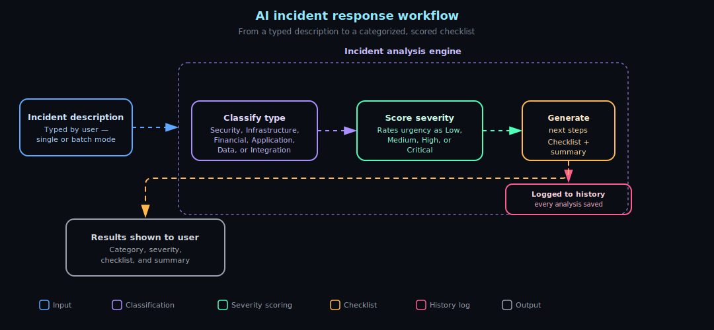

# 🚨 AI Incident Response System

A simple web app that reads a description of a tech problem (an "incident") and tells you three things: what kind of problem it is, how serious it is, and what steps to take next. 🧐 You type in something like *"the website is down and the database is overloaded,"* and it sorts it, scores it, and hands you a checklist. ✅

You run it inside Google Colab, which is a free tool from Google that lets you run code in your browser. 🌐 You don't need to install anything on your computer, and you don't need to sign up for any service beyond a free Google account.

## ✨ What it can do

- 🗂️ Sorts incidents into six types: Security, Infrastructure, Financial, Application, Data, and Integration
- 🌡️ Rates how urgent each one is (Low, Medium, High, or Critical)
- 📋 Suggests a list of next steps for each type of problem
- 📝 Writes a short summary of what you typed
- 🔢 Handles one incident at a time, or a whole batch at once
- 📜 Keeps a running history of everything you've analyzed

## 🧰 What you'll need

- ✅ A free Google account
- 🖥️ A web browser
- ⏱️ About five minutes

That's it. No downloads, no payment, no setup on your own machine. 🎉

## 🚀 Getting it running

The whole thing happens in Google Colab. You'll create a notebook, paste in a few blocks of code, and run them one at a time. Each block has a "play" button (▶️) next to it — clicking that runs it.

**1. Open a new notebook.** 📓 Go to [colab.research.google.com](https://colab.research.google.com) and choose *File → New notebook*.

**2. Turn on the faster hardware.** ⚡ In the top menu, click *Runtime → Change runtime type*, pick **GPU**, and save. This makes the app run quicker, but it isn't required — it'll work without it, just a little slower.

**3. Install the tools.** 📦 Paste the first code block (from the setup file) into the first cell and run it. This downloads the pieces the app needs and takes three to four minutes the first time.

**4. Build the app.** 🔨 Paste the second code block into a new cell and run it. This takes a few seconds and creates the app file.

**5. Start it up.** ▶️ Paste the third code block into a new cell and run it. Leave this cell running the whole time you're using the app — if you stop it, the app goes offline.

**6. Open it.** 🔗 In one more new cell, paste the last short block of code and run it. A clickable link appears. Click it, and the app opens in a new tab.

## Architecture

## 🧪 Using the app

**👉 One problem at a time:** Type a description of what's going wrong, click *Analyze*, and the results appear right away.

**📊 Several at once:** Switch to Batch mode, paste in your incidents (one per line, up to ten), and click *Analyze Batch*. You'll get results for each one.

## 💡 Things to try

Paste any of these into the app to see how it works:

- "Database crashed at 2 PM. CPU at 95%. All services down."
- "Security breach detected. Attackers accessed admin panel."
- "Payment gateway returning 503 errors. Customers can't checkout."
- "Website loading slowly. Pages taking 20 seconds."

## 🆘 If something doesn't work

**🐢 It's slow the first time.** The very first analysis takes around 30 seconds because the app is still getting set up behind the scenes. After that, each one takes a couple of seconds.

**🔗 The app won't open.** Make sure you ran the last step (step 6) — that's the one that gives you the clickable link.

**📴 The app went offline.** The "start it up" cell (step 5) needs to keep running. If you stopped it or closed the tab, start it again.

**🔄 Something seems stuck.** From the top menu, choose *Runtime → Restart runtime* and run the steps again from the top.

---

⚠️ A quick note on accuracy: the app is a helpful first pass, not a final verdict. Treat its categories, urgency ratings, and suggestions as a starting point, and use your own judgment before acting on anything important.
